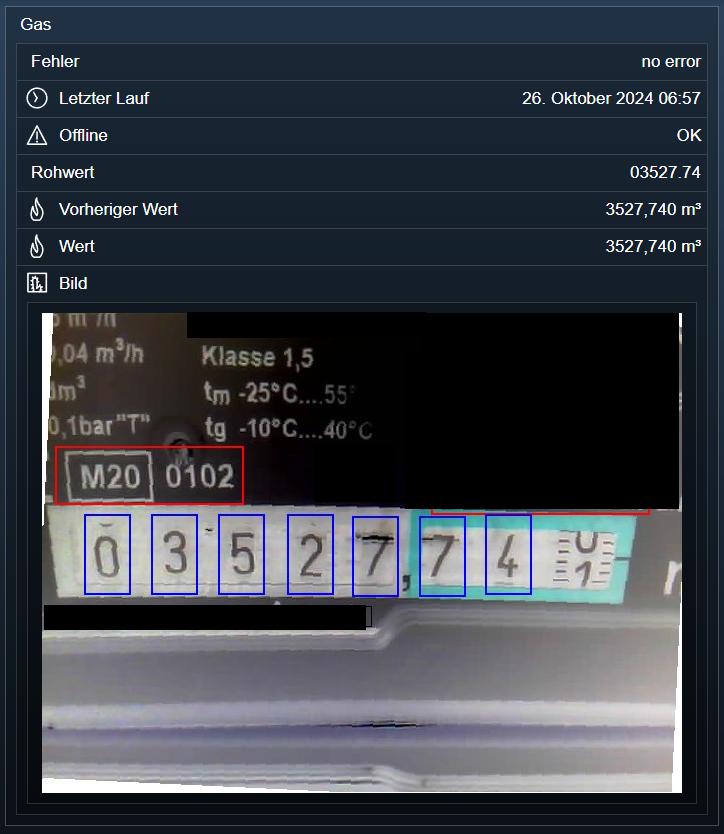

[](https://www.symcon.de/service/dokumentation/entwicklerbereich/sdk-tools/sdk-php/)
[]()
[](https://www.symcon.de/de/service/dokumentation/installation/migrationen/v70-v71-q1-2024/)  
[](https://creativecommons.org/licenses/by-nc-sa/4.0/)
[](https://github.com/Nall-chan/AI-on-the-Edge/actions)
[](https://github.com/Nall-chan/AI-on-the-Edge/actions)  
[](#2-spenden)[](#2-spenden)  

# AI on the Edge Device <!-- omit in toc -->
Einbinden von `AI on the Edge Device` Geräten in IPS.  

### Inhaltsverzeichnis  <!-- omit in toc -->

- [1. Funktionsumfang](#1-funktionsumfang)
- [2. Voraussetzungen](#2-voraussetzungen)
- [3. Software-Installation](#3-software-installation)
- [4. Einrichten der Instanzen in IP-Symcon](#4-einrichten-der-instanzen-in-ip-symcon)
  - [Konfigurationsseite: Symcon](#konfigurationsseite-symcon)
  - [Konfigurationsseite: Ai on the Edge Device](#konfigurationsseite-ai-on-the-edge-device)
  - [Funktionstest: Symcon](#funktionstest-symcon)
- [5. Statusvariablen und Profile](#5-statusvariablen-und-profile)
    - [Statusvariablen](#statusvariablen)
    - [Profile](#profile)
- [6. Visualisierung](#6-visualisierung)
- [7. PHP-Befehlsreferenz](#7-php-befehlsreferenz)
- [8. Fehlersuche](#8-fehlersuche)
- [9. Anhang](#9-anhang)
  - [1. Changelog](#1-changelog)
  - [2. Spenden](#2-spenden)
- [10. Lizenz](#10-lizenz)


## 1. Funktionsumfang

* Darstellen der empfangenen Werte
* Darstellen des letzten Digitizer Bildes
* Offline Überwachung des Gerätes

## 2. Voraussetzungen

* IP-Symcon ab Version 7.1
* [AI on the Edge Device](https://jomjol.github.io/AI-on-the-edge-device-docs/)

## 3. Software-Installation

* Dieses Modul ist Bestandteil der [AI on the Edge Device-Library](../README.md#3-software-installation).  

## 4. Einrichten der Instanzen in IP-Symcon

 Unter 'Instanz hinzufügen' kann das 'AI on the Edge Device'-Modul mithilfe des Schnellfilters gefunden werden.  
   
 Nach der Installation über den Store, wird abgefragt ob eine Instanz von diesem Modul automatisch angelegt werden soll.

 Weitere Informationen zum Hinzufügen von Instanzen in der [Dokumentation der Instanzen](https://www.symcon.de/service/dokumentation/konzepte/instanzen/#Instanz_hinzufügen)

 ### Konfigurationsseite: Symcon
 
 
| Name                        | Text                                    | Typ    | Beschreibung                                            |
| --------------------------- | --------------------------------------- | ------ | ------------------------------------------------------- |
|                             | Host                                    | string | Der Host wird automatisch ermittelt (*1)                |
| ApiKey                      | API-Key                                 | string | API-Key aus dem Gerät, sofern vergeben                  |
| ValueProfile                | Typ der Werte                           | string | Profil für die Variablen (Water.m3 oder Gas.m3)         |
| EnablePreValue              | Aktiviere Vorheriger Wert               | bool   | Vorheriger Wert als Variable anlegen                    |
| EnableRawValue              | Aktiviere Rohwert                       | bool   | Rohwert als Variable anlegen                            |
| EnableSnapshotImage         | Erstelle Snapshot Bild                  | bool   | Snapshot Bild als Medien-Objekt abspeichern             |
| EnableTimeoutVariable       | Aktiviere Offline Variable              | bool   | Offline Variable anlagen                                |
| EnableTimeoutInstanceStatus | Aktiviere Instanz Fehlerzustand         | bool   | Instanz in Fehlerzustand setzen, wenn Gerät offline ist |
| Timeout                     | Zeit bis Gerät als offline erkannt wird | int    | Timeout wann das Gerät als Offline erkannt wird         |
| DigitizeIntervall           | Intervall zum starten des Flow          | int    | Intervall in welchem digitalisiert werden soll (*2)     |

_(*1) Siehe weiter unten._  
_(*2) Sollte nur benutzt werden, wenn der Auto-Timer im Gerät viel größer ist als die Timeout Erkennung._ 

  

### Konfigurationsseite: Ai on the Edge Device

Auf der Website des `Ai on the Edge Device` ist unter `Settings` -> `Configuration` der Abschnitt `Webhook` zu aktivieren.

In das Feld URI wird der angezeigte Webhook aus der zuvor in Symcon angelegten Instanz eingetragen.  
Zeigt die Instanz mehrere URLs an, so ist die URL mit der IP-Adresse aus dem gleichen Subnetz wie dem `Ai on the Edge Device` einzutragen.  
Der ApiKey muss identisch mit dem in der Symcon Instanz sein.  
Unter Upload Image sollte `Always` augewählt werden, sofern das Bild in Symcon dargestellt werden soll.  

Anschließend die Einstellungen speichern und das Gerät neu starten.  

  

### Funktionstest: Symcon 

Sobald das Gerät sich erfolgreich mit Symcon verbunden hat, wechselt die Instanz auf `aktiv` und das Feld `Host` wird mit dem Hostnamen des Gerätes aktualisiert.  

Je nach Gerät und Dauer der Digitalisierung kann dies einige Minuten dauern.  

Sonst siehe [Fehlersuche](#8-fehlersuche).  

## 5. Statusvariablen und Profile

Die Statusvariablen/Kategorien werden automatisch angelegt.  
Das Löschen einzelner kann zu Fehlfunktionen führen.

#### Statusvariablen

| Ident     | Name            | Typ    | Beschreibung                           |
| --------- | --------------- | ------ | -------------------------------------- |
| Timestamp | Letzter Lauf    | int    | Datum und Uhrzeit vom letzten Lauf     |
| Value     | Wert            | float  | Aktueller Wert                         |
| Error     | Fehler          | string | Fehlermeldung vom Gerät                |
| PreValue  | Vorheriger Wert | float  | Vorheriger Wert                        |
| RawValue  | Rohwert         | string | Rohwert der Digitalisierung            |
| Offline   | Offline         | bool   | false wenn Gerät offline erkannt wurde |

#### Profile

| Name     | Typ   |
| -------- | ----- |
| Gas.m3   | float |
| Water.m3 | float |

## 6. Visualisierung

Die direkte Darstellung der Instanz und deren Statusvariablen ist möglich; es wird aber empfohlen mit Links zu arbeiten.  
  

## 7. PHP-Befehlsreferenz

```php
bool AOTED_ReadValues(int $InstanzID);
```
Liest die aktuellen Werte aus und schreibt das Ergebnis in die Statusvariablen.  
Liefert true bei Erfolg und false im Fehlerfall.  

*Beispiel:* 
```php
AOTED_ReadValues(12345);
```
---

```php
bool AOTED_LoadImage(int $InstanzID);
```
Liest das Bild der letzten Digitalisierung aus.  
Liefert true bei Erfolg und false im Fehlerfall.  

*Beispiel:* 
```php
AOTED_LoadImage(12345);
```
```php
bool AOTED_StartFlow(int $InstanzID);
```
Sendet einen `Start Flow` Befehl an das Gerät und triggert somit das digitalisieren und auslesen der Werte.  
Liefert true bei Erfolg und false im Fehlerfall.  

*Beispiel:* 
```php
AOTED_StartFlow(12345);
```
---
## 8. Fehlersuche

- Die Instanz wird nicht aktiv.
  - Prüfe ob der Webhook im Gerät korrekt eingerichtet wurde.  
  - Vergleiche den API-Key in der Instanz und im Gerät.  
  - Öffne den Webhook in einem Browser um zu testen ob Symcon erreichbar ist (anklicken).  
  - Wurden entsprechend der eingestellten Minuten des Auto Timer vom Gerät gewartet? Das Gerät senden die Daten nur nach einem Flow.  
- Ich habe mehrere Geräte ...
  - Lege pro Gerät eine Instanz in Symcon an. Beachte das die URL des Webhook sind unterscheiden werden.  
- Warum steht bei Host der falsche Name?
  - Der Hostname wird automatisch beim ersten Verbinden ermittelt. Sollte sich der Name ändern oder hier eine fest IP-Adresse gewünscht sein, so kann die Adresse über den Button `Adresse überschreiben` angepasst werden.
- Die Buttons im Testcenter funktionieren nicht. Ich bekomme eine Fehlermeldung.
  - Dann enthält das Feld `Host` noch keine Adresse vom Gerät. Entweder warten bis die Instanz aktiv wird, oder manuell eine Adresse eintragen.  
- Hilfe es werden falsche Werte gelesen.
  - Das Modul kann nur die Empfangenen werte darstellen. Ein FAQ für Fehler beim erkennen sind auf der [Seite von jomjol](https://jomjol.github.io/AI-on-the-edge-device-docs/ROI-Configuration/) zu finden
  
## 9. Anhang

### 1. Changelog

[Changelog der Library](../README.md#2-changelog)

### 2. Spenden

Die Library ist für die nicht kommerzielle Nutzung kostenlos, Schenkungen als Unterstützung für den Autor werden hier akzeptiert:  

<a href="https://www.paypal.com/donate?hosted_button_id=G2SLW2MEMQZH2" target="_blank"></a>  

[](https://www.amazon.de/hz/wishlist/ls/YU4AI9AQT9F?ref_=wl_share) 

## 10. Lizenz

  IPS-Modul:  
  [CC BY-NC-SA 4.0](https://creativecommons.org/licenses/by-nc-sa/4.0/)  
