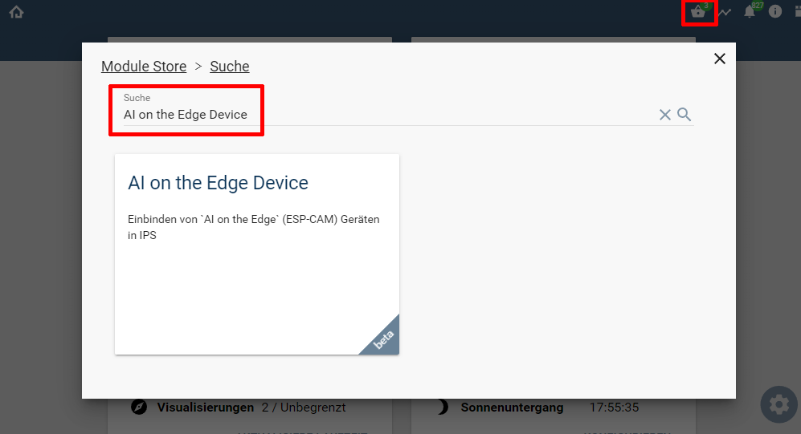

  

  
  

# AI on the Edge Device  <!-- omit in toc -->
Einbinden von `AI on the Edge Device` Geräten in IPS.  

## Inhaltsverzeichnis <!-- omit in toc -->

- [1. Vorbemerkungen](#1-vorbemerkungen)
- [2. Voraussetzungen](#2-voraussetzungen)
- [3. Software-Installation](#3-software-installation)
- [4. Enthaltende Module](#4-enthaltende-module)
- [5. Anhang](#5-anhang)
	- [1. GUID der Module](#1-guid-der-module)
	- [2. Changelog](#2-changelog)
	- [3. Spenden](#3-spenden)
- [6. Lizenz](#6-lizenz)

----------
## 1. Vorbemerkungen

## 2. Voraussetzungen

* IP-Symcon ab Version 7.1
* [AI on the Edge Device](https://jomjol.github.io/AI-on-the-edge-device-docs/)
 
 ## 3. Software-Installation
  
  Über den 'Module-Store' in IPS das Modul `AI on the Edge` hinzufügen.  
   **Bei kommerzieller Nutzung (z.B. als Errichter oder Integrator) wenden Sie sich bitte an den Autor.**  
 

  ## 4. Enthaltende Module

- __AI on the Edge Device__ ([Dokumentation](AI%20on%20the%20Edge%20Device/README.md))  
	Einbindung in Symcon per Webhook & REST-API.

## 5. Anhang

###  1. GUID der Module
 
|         Modul         |  Typ  | Prefix |                  GUID                  |
| :-------------------: | :---: | :----: | :------------------------------------: |
| AI on the Edge Device | Gerät | AOTED  | {C6259AA4-C24A-ED2E-AE6F-F6DB1F6B3584} |

----------
### 2. Changelog

**Version 1.00:**  
- Beta Release für Symcon 7.1  

----------
### 3. Spenden  
  
  Die Library ist für die nicht kommerzielle Nutzung kostenlos, Schenkungen als Unterstützung für den Autor werden hier akzeptiert:  

 

## 6. Lizenz

  IPS-Modul:  
  [CC BY-NC-SA 4.0](https://creativecommons.org/licenses/by-nc-sa/4.0/)  
 
